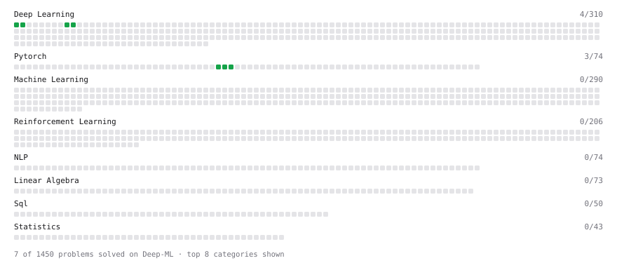

# Deep-ML

My machine learning practice from [Deep-ML](https://www.deep-ml.com). Every solution here was written by hand.

**8** solved · 6 problems · 0 labs · 2 math

[**Browse the interactive portfolio**](https://jimmmmmmmmmmmy.github.io/deep-ml-solutions/) to replay this filling in over time.

## Problems

| | Difficulty | Solved | |
| --- | --- | --- | --- |
| [Create and Inspect a Tensor](https://www.deep-ml.com/problems/1220) | easy | 2026-09-24 | [solution](problems/1220-create-and-inspect-a-tensor) |
| [Implement ReLU Activation Function](https://www.deep-ml.com/problems/42) | easy | 2026-09-17 | [solution](problems/0042-implement-relu-activation-function) |
| [Leaky ReLU Activation Function](https://www.deep-ml.com/problems/44) | easy | 2026-09-17 | [solution](problems/0044-leaky-relu-activation-function) |
| [Reshape and Transpose a Tensor](https://www.deep-ml.com/problems/1221) | easy | 2026-09-24 | [solution](problems/1221-reshape-and-transpose-a-tensor) |
| [Sigmoid Activation Function Understanding](https://www.deep-ml.com/problems/22) | easy | 2026-09-17 | [solution](problems/0022-sigmoid-activation-function-understanding) |
| [Softmax Activation Function Implementation ](https://www.deep-ml.com/problems/23) | easy | 2026-09-17 | [solution](problems/0023-softmax-activation-function-implementation) |

## Math

| | Difficulty | Solved | |
| --- | --- | --- | --- |
| [Derivatives and Gradients](https://www.deep-ml.com/math-problems/1) | easy | 2026-09-16 | [solution](math/0001-derivatives-and-gradients) |
| [Gradient Descent Updates](https://www.deep-ml.com/math-problems/5) | easy | 2026-09-17 | [solution](math/0005-gradient-descent-updates) |

---

_This file is regenerated by Deep-ML on every push._
